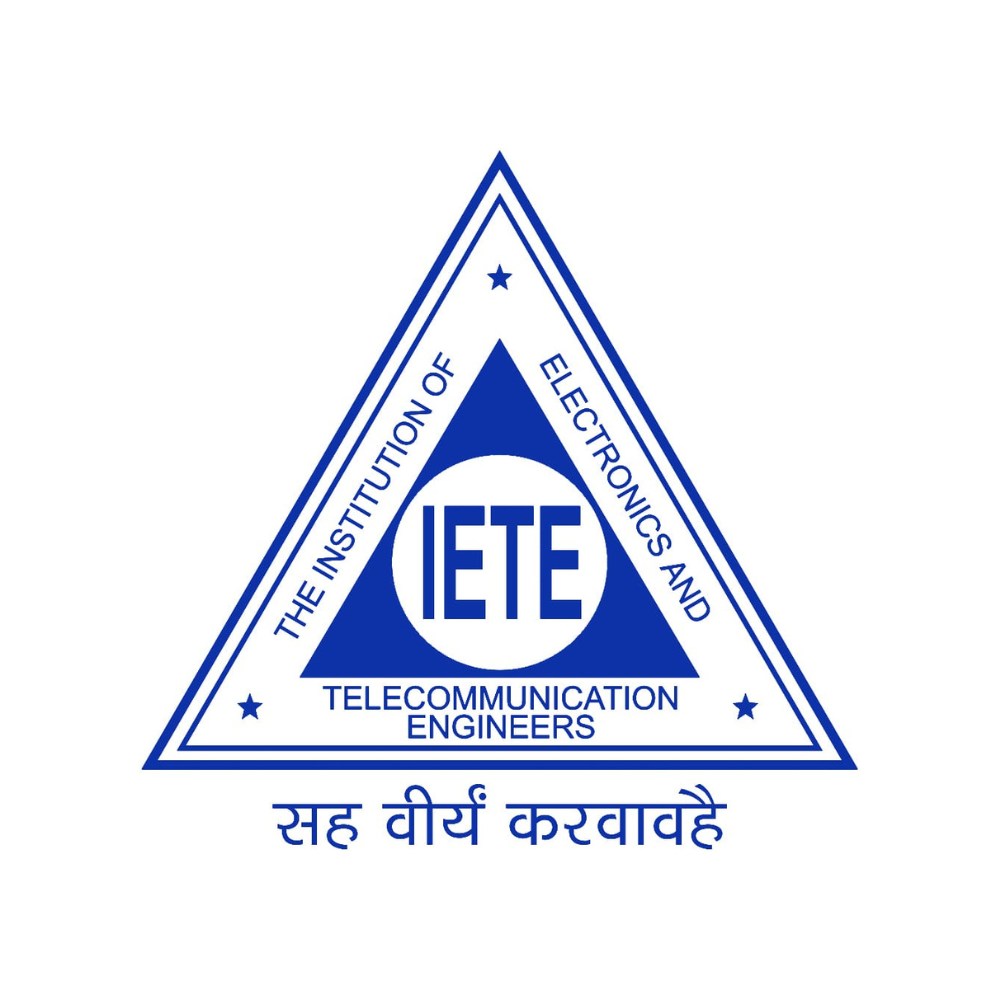

# IETE KJSIT - The Official Hub



> **Where Innovation Converges** - The official website for the IETE Technical Committee at KJSIT. Explore our events, meet the team, and join our community of innovators.

## 🚀 About IETE KJSIT

The IETE Student Chapter of KJSIT is a nexus for creators, thinkers, and pioneers. We transcend the conventional, pushing the boundaries of technology and engineering to build a smarter tomorrow. This is our digital hub.

### 🏆 Achievements
- **3rd Best ISF in Mumbai** - Awarded by IETE-India for outstanding contribution to technical education and innovation
- **50+ Events Hosted** - Creating opportunities for students to showcase their technical prowess
- **5000+ Participants Engaged** - Building a community of like-minded innovators

## ✨ Features

### 🎨 Modern Design
- **Cyberpunk Aesthetic** - Futuristic design with neon effects and animations
- **Responsive Layout** - Optimized for all devices and screen sizes
- **Interactive Elements** - Smooth animations and hover effects
- **Three.js Background** - Dynamic particle system for immersive experience

### 🎯 Key Sections
- **Welcome Screen** - Animated splash screen with loading progress
- **Renaissance 2025** - Annual tech festival showcase
- **Events** - Technical and non-technical events including Oscillations
- **Team** - Core team, subcore team, and team groups
- **About Us** - Our story, guiding pillars, and community

### 🛠️ Technical Stack
- **HTML5** - Semantic markup structure
- **CSS3** - Advanced styling with custom properties and animations
- **JavaScript (ES6+)** - Modern JavaScript with GSAP animations
- **Three.js** - 3D graphics and particle systems
- **Tailwind CSS** - Utility-first CSS framework
- **Google Fonts** - Custom typography (Xirod, Goldman, Aboreto)

## 🎪 Events & Activities

### Renaissance 2025 - Arena of Innovation
Our flagship annual tech festival featuring:

#### Technical Events
- **DeCodeX** - Reverse engineering coding challenges
- **Prompt Showdown** - AI vs AI competition
- **Digital Sherlock** - Cyber detective challenges
- **Code Golf** - Concise programming competition

#### Non-Technical Events
- **IPL Auction** - Strategic bidding simulation
- **FIFA & F1 on PS5** - Gaming tournaments
- **Alice in Borderland** - Multi-game challenges
- **Social Buzz** - Social media competitions

### Oscillations
Our premier annual technical festival conducted under IETE-India guidelines, featuring:
- Code Housie
- IPL Auction
- PS5 Gaming
- Techno Tinker
- Squid Games
- Capture The Flag (CTF)

## 👥 Team Structure

### Leadership
- **Chairperson** - Manjiri Kadam
- **Vice Chairperson** - Kislay Gupta

### Core Team
- **Secretary** - Aaditi Indamdar
- **Treasurer** - Pooja Shah
- **Digital Media Manager** - Ayesha Shaikh
- **Chief Technical Officer** - Subroto Datta
- **Chief Executions Officer** - Sainath Shobhane
- **Public Relations Officer** - Pratul Jagtap

### Team Groups
- **Creative Team** - Design and visual solutions
- **Marketing Team** - Community presence and outreach
- **Organizing Team** - Event management and execution
- **PR Team** - Public relations and networking
- **Technical Team** - Technology solutions and development

## 🎨 Design System

### Color Palette
- **Primary Blue**: `#1e90ff` - Main brand color
- **Accent Orange**: `#ff6b35` - Secondary accent
- **Neon Effects**: Gradient combinations for futuristic feel
- **Background**: `#000000` - Deep space black

### Typography
- **Display Font**: Xirod - For headings and titles
- **Header Font**: Goldman - For section headers
- **Body Font**: Aboreto - For content and descriptions

### Animations
- **GSAP Animations** - Smooth scroll-triggered animations
- **Text Scramble** - Cyberpunk text effects
- **Particle System** - Interactive background elements
- **Marquee Effects** - Continuous scrolling for team and sponsor sections

## 🚀 Getting Started

### Prerequisites
- Modern web browser (Chrome, Firefox, Safari, Edge)
- Local web server (for development)

### Development
- Edit HTML, CSS, or JavaScript files
- Refresh browser to see changes
- Use browser developer tools for debugging

## 📁 Project Structure

```
iete-kjsit/
├── assets/
│   ├── fonts/
│   │   └── Xirod.woff2
│   └── images/
│       ├── Core/           # Leadership team photos
│       ├── events/         # Event images and flyers
│       ├── teams/          # Team group photos
│       ├── Sponsors/       # Partner logos
│       └── Subcore/        # Subcore team photos
├── index.html              # Main HTML file
├── style.css              # Main stylesheet
├── script.js              # JavaScript functionality
├── animations.js          # Animation configurations
├── cyberpunk-effects.css  # Special effects styling
├── teams.css             # Team-specific styles
└── README.md             # Project documentation
```

## 🎯 Key Features

### Interactive Elements
- **Smooth Scrolling** - GSAP-powered navigation
- **Loading Screen** - Animated splash with progress bar
- **Hover Effects** - Interactive card animations
- **Mobile Menu** - Responsive navigation
- **Particle System** - Dynamic background effects

### Performance Optimizations
- **Lazy Loading** - Images load as needed
- **CSS Animations** - Hardware-accelerated transitions
- **Responsive Images** - Optimized for different screen sizes
- **Minified Assets** - Compressed CSS and JavaScript

## 🌐 Browser Support

- **Chrome** 80+
- **Firefox** 75+
- **Safari** 13+
- **Edge** 80+

## 📱 Mobile Responsiveness

The website is fully responsive and optimized for:
- **Desktop** (1200px+)
- **Tablet** (768px - 1199px)
- **Mobile** (320px - 767px)


### Development Guidelines
- Follow the existing code style
- Test on multiple browsers and devices
- Ensure responsive design
- Optimize for performance
- Document new features

## 📞 Contact & Support

- **Email**: iete.tech@somaiya.edu
- **LinkedIn**: [IETE KJSIT](https://www.linkedin.com/company/iete-kjsit/)
- **Instagram**: [@iete_kjsit](https://www.instagram.com/iete_kjsit?igsh=c3phcnR3aTFvM241)

## 🏫 About KJSIT

K. J Somaiya Institute of Technology is a premier engineering institution in Mumbai, known for its excellence in technical education and innovation. The IETE Student Chapter serves as a bridge between academic learning and practical application.

## 🙏 Acknowledgments

- **IETE-India** - For guidance and support
- **KJSIT Faculty** - Dr. Priya Hankare (Faculty Coordinator), Dr. Jayashree Khanapuri (HOD, EXTC)
- **Our Sponsors** - RedBull, Apsara Ice Creams, Love & Latte, and many more
- **Technical Team** - All contributors to the project
- **Community** - All participants and supporters of IETE KJSIT
---

**Built with ❤️ by the IETE KJSIT Technical Team - 2025-2026**
